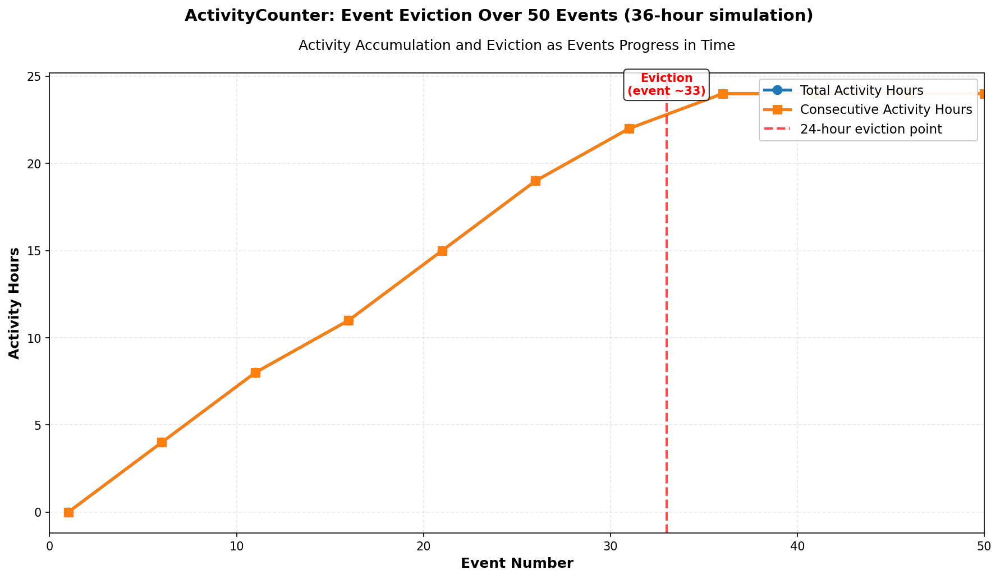

#### ActivityCounter - How It Works

Track which hours in a 24-hour period had activity using a **24-bit bitset** (3 bytes).

**Traditional approach:**
```
Array[24]: [1, 1, 0, 1, 1, 0, 1, ...]  (one byte per hour)
Plus: first_time, last_time, counters
Storage: ~32 bytes minimum
```

**ActivityCounter approach:**
```
24-bit bitset: 111011010000000000000000 (in binary)
Storage: 3 bytes
Bit 0 = hour 0, Bit 1 = hour 1, etc.
Activity: hours 0,1,3,4,6 had events
```

**Data Structure:**

```
bitset[3]: 3 × uint8_t = 3 bytes total
- bitset[0]: bits 0-7 (hours 0-7)
- bitset[1]: bits 8-15 (hours 8-15)
- bitset[2]: bits 16-23 (hours 16-23)
```

#### How It Works

1. Insert Activity
When event arrives at time T:

```cpp
current_hour = (T % 86400) / 3600;  // which hour (0-23)

// Calculate shift = hours since last event
shift = current_hour - last_hour;

// Shift bitset right by 'shift' positions
// (older hours fall off, new hours set to 0)
bitset >>= shift;

// Set highest bit (current hour had activity)
bitset[2] |= 0x80;  // Set bit 23 (latest hour)
```

2. Day Boundary Detection
Gap > 24 hours triggers:
- Clear bitset (all hours become 0)
- Reset to new day

```
Gap from hour 20 to next day hour 5 (25 hours)
-> Clear bitset, hour 5 set to 1
```

3. Auto-Shift on Time Progress
As time moves through the day:

```
Hour 0: bitset = 100000000000000000000000 (bit 0 active)
Hour 1: bitset = 110000000000000000000000 (bits 0-1 active)
Hour 5: bitset = 111111000000000000000000 (bits 0-5 active)
Hour 23: bitset = 111111111111111111111111 (all bits active)

New day hour 1: bitset = 000000000000000000000010 (bit 1 active)
```

#### Key Features

1. Total Activity (Last 24 Hours)
Count total number of 1-bits = hours with activity

```
bitset = 111011010000000000000000
Count of 1s = 6 hours
```

2. Consecutive Activity
Count consecutive 1-bits from the right (latest hour)

```
bitset = 111011010000000000000000
       ↓ (counting from right)
Consecutive = 0 (no activity in latest hours)

bitset = 111011111111111111111111
       ↑↑↑↑↑↑↑↑↑↑↑↑↑↑↑↑↑↑↑↑↑↑ (from right)
Consecutive = 21 hours (last 21 hours active)
```

3. Day-Aware Shifting
Automatically shifts away old hours as time progresses

```
Hour 5 (events at 4:00, 4:30)
bitset = 000000000000000000100000

Hour 8 (no new events, 3 hours passed)
bitset = 000000000000000000000000 (shifted right by 3)

Hour 8 with event
bitset = 000000000000000000001000
```

#### Memory Calculation

Per user: 3 bytes (vs 32+ bytes traditional)

**At scale (1 million users):**
- Traditional: 32 MB
- ActivityCounter: 3 MB
- Savings: 29 MB (90%)

#### Code Example

```cpp
ActivityCounter ac;

// Hour 0, event at time 0
ac.update(0, 0);
// bitset has bit 0 set

// Hour 5, events at times 3600*5
ac.update(3600*5, 3600*4);
// shift by 1 hour, set bit 5

// Hour 10, events at time 3600*10
ac.update(3600*10, 3600*9);
// shift by 1 hour, set bit 10

uint8_t total_hours = ac.getLast24HoursActivity();        // 3 hours
uint8_t consecutive = ac.getLatestConsecutiveActivity();  // 1 hour (only latest)
```

#### Analysis



#### Performance

- Update: O(1)
- Query: O(1)
- Memory: Constant 3 bytes per user
