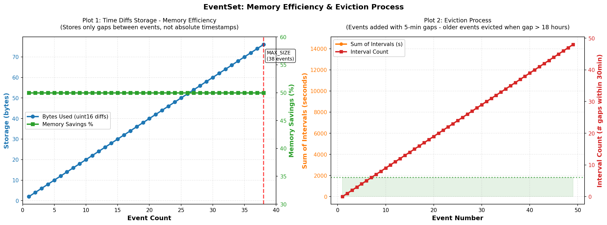

### IntervalSet - How It Works

Instead of storing absolute event timestamps, store only the **time differences** between consecutive events.

**Traditional approach:**
```
Events: [1000, 1300, 1600, 1900]
Storage: 4 bytes × 4 = 16 bytes
```

**IntervalSet approach:**
```
min_time = 1000
time_shifts = [300, 300, 300]  ← differences only
Storage: 2 bytes × 3 = 6 bytes (50% savings)

To reconstruct: 1000 → 1000+300=1300 → 1300+300=1600 → 1600+300=1900
```

**Data Structure:**

```
min_time: uint32_t        ← first event time
time_shifts[38]: uint16_t ← gaps to next events (max 38 events)

Statistics:
- sum_of_lengths          ← sum of intervals ≤ 30min
- sum_of_squared_lengths  ← for variance calculation
- interval_between_events_count ← count of intervals ≤ 30min
```

#### Key Features

1. Automatic Eviction
When a gap > 18 hours detected:
- Old events are evicted
- Buffer clears
- New min_time set

```
Events: [1000, 2000, 3000, 100000]
Gap 3000→100000 is > 18 hours
Result: min_time = 100000, time_shifts reset
```

2. 30-Minute Threshold
Only tracks statistics for intervals ≤ 1800 seconds:
- Sum of gaps
- Sum of squared gaps (for stddev)
- Count of short gaps

```
Intervals: [100, 200, 5000]  (only first two ≤ 1800)
sum_of_lengths = 300
interval_count = 2
```

3. Insertion Logic
When inserting event at time T:

1. **First event**: Store as min_time, done
2. **Gap > 18 hours**: Clear buffer, store as min_time
3. **Insert in order**: Shift array, store new gap
4. **Buffer full (38 events)**: Evict oldest, add new

#### Memory Calculation

Per event: 2 bytes (uint16_t gap) vs 4 bytes (uint32_t timestamp)

**At scale (1 billion events):**
- Traditional: 4 GB
- IntervalSet: 2 GB
- Savings: 2 GB (50%)

## Code Example

```cpp
IntervalSet es;

es.insert(1000);  // min_time = 1000
es.insert(1300);  // time_shifts[0] = 300
es.insert(1600);  // time_shifts[1] = 300
es.insert(1900);  // time_shifts[2] = 300

uint32_t sum = es.getSumOfLengths();           // 900
uint32_t count = es.getIntervalBetweenEventsCount(); // 3
uint32_t sum_sq = es.getSumOfSquaredLengths(); // 270000
```

## Analysis



## Performance

- Insert: O(n) where n ≤ 38
- Query: O(1)
- Memory: Sub-linear growth (bounded by 38 events)
