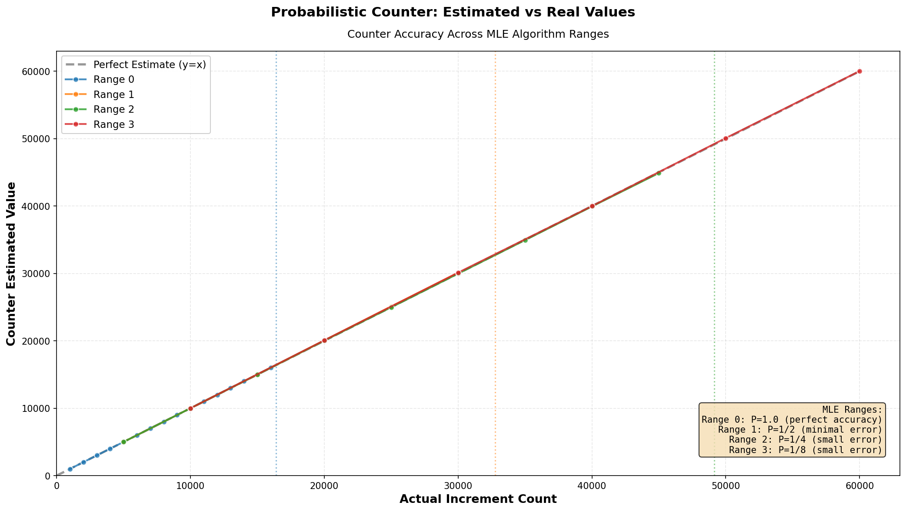

#### ProbabilisticCounter - How It Works

Track very large counts (up to **2.6 billion**) using only **16 bits** of storage.

**Traditional approach:**
```
Full uint64_t counter: stores exact value
Storage: 8 bytes per counter
```

**ProbabilisticCounter approach:**
```
Internal 16-bit count: 42,000 (compressed representation)
Estimated value: ~2,600,000,000 (via lookup table)
Storage: 2 bytes
```

**Data Structure:**

```
count: uint16_t = 2 bytes
precalced: lookup tables (shared, computed once)
  - result[65536]: maps internal count → estimated value
  - mult[65536]: maps internal count → probability multiplier
```

#### How It Works

1. **Increment with Decreasing Probability**

As internal count grows, increments become rarer:

```cpp
// count < 2^14 (16,384): always increment
// 2^14 to 2^15: increment with probability 1/2
// 2^15 to 2^15+2^14: increment with probability 1/4
// And so on...

counter.increment();
// ~50% chance to actually increment when count is in mid-range
// ~0.1% chance when count is very large
```

2. **Probability-Based Increment**

```cpp
if (count < 16384 ||
    random.nextDouble() < 1.0 / precalced.getMult(count)) {
    count++;  // Increment with probability 1/precalced.getMult(count)
}
```

3. **Convert to Estimate**

```cpp
uint32_t estimate = precalced.getResult(count);
// Lookup table converts internal count to estimated actual value
```

#### Key Features

1. **Space Efficient**
   - 2 bytes per counter (vs 8 bytes for uint64_t)
   - 75% memory savings

2. **Maximum Likelihood Estimation (MLE)**
   - Precalculated lookup tables ensure optimal accuracy
   - Highest probability for true value given observed count

3. **O(1) Operations**
   - Increment: single random check + conditional increment
   - Query: one lookup table read

#### Code Example

```cpp
ProbabilisticCounter counter;

// Increment 1 million times
for (int i = 0; i < 1000000; i++) {
    counter.increment();
    // Early increments: always succeed (count 0-16,384)
    // Later increments: succeed with probability 1/2, 1/4, etc.
}

uint32_t estimate = counter.getValue();
// Returns ~1,000,000 (accurate estimate)
// Internal storage: only count=42,000 (2 bytes)
```

#### Memory Calculation

Per counter: 2 bytes (vs 8 bytes traditional)

**At scale (100 million counters):**
- Traditional: 800 MB
- ProbabilisticCounter: 200 MB
- Savings: 600 MB (75%)

#### Analysis



#### Performance

- Increment: O(1)
- Query: O(1)
- Memory: Constant 2 bytes per counter
